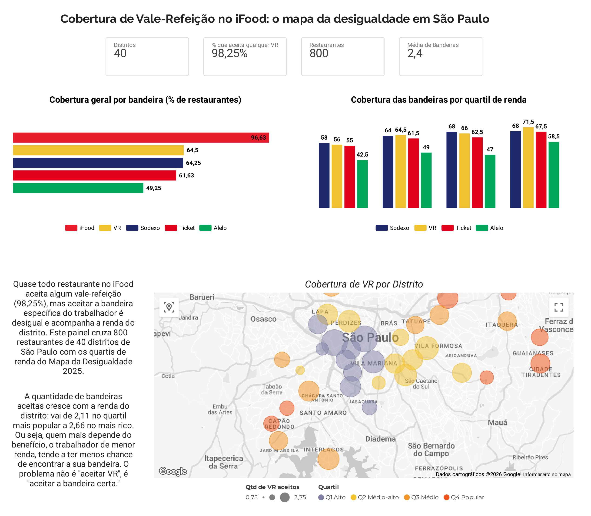
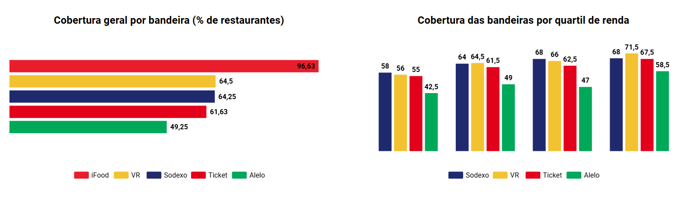
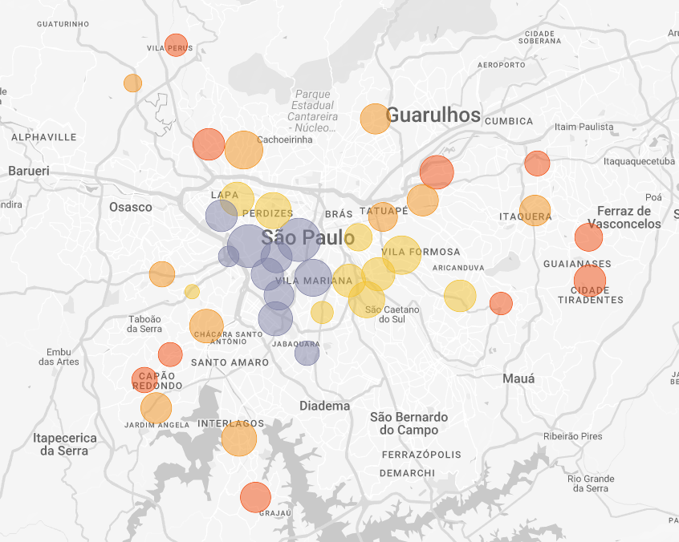

# Cobertura de Vale-Refeição no iFood: o mapa da desigualdade em São Paulo


Análise de dados que investiga se a aceitação de bandeiras de vale-refeição (VR) nos restaurantes do iFood acompanha a desigualdade socioeconômica entre os distritos de São Paulo. O projeto cruza dados coletados do iFood com os indicadores de Trabalho e Renda do Mapa da Desigualdade 2025, da Rede Nossa São Paulo.

## Principal achado

Quase todo restaurante aceita **algum** vale-refeição (98,2%), mas aceitar a **bandeira específica** do trabalhador é desigual e acompanha a renda do distrito. A quantidade média de bandeiras privadas aceitas cresce de forma consistente entre os quartis de renda, de **2,11 no quartil mais popular a 2,66 no mais rico**. O trabalhador de menor renda, que mais depende do benefício, tende a ter menos chance de encontrar a sua bandeira.

O problema não está em "aceitar VR", mas em "aceitar a bandeira certa", e isso acompanha o mapa da desigualdade da cidade.

## Dashboard interativo

Painel construído no Looker Studio (Data Studio), com KPIs, cobertura por bandeira, comparação por quartil de renda e mapa de cobertura por distrito.

**[Acesse o dashboard interativo aqui](Chttps://datastudio.google.com/reporting/d38c9e68-5d34-4d7f-b5c8-922fe8e620d6/page/EnZ1F)**



## Resultados em números

| Indicador | Valor |
|---|---|
| Restaurantes analisados | 800 |
| Distritos | 40 (10 por quartil de renda) |
| Aceita qualquer VR | 98,2% |
| Cobertura média das 4 bandeiras privadas | 59,9% |
| Bandeiras privadas por restaurante: Q4 popular vs Q1 alto | 2,11 vs 2,66 |

Cobertura por bandeira: iFood Benefícios 96,6%, VR 64,5%, Sodexo 64,2%, Ticket 61,6%, Alelo 49,2%.

## Hipóteses e o que os dados mostraram

- **H1 (confirmada como tendência):** distritos de maior renda têm maior cobertura de bandeiras de VR. A relação aparece de forma robusta entre os quartis de renda (tendência de Spearman significativa para Alelo e VR, confirmada por qui-quadrado), embora a associação linear no nível do distrito individual seja fraca.
- **H2 (confirmada, hipótese mais sólida):** a aceitação de "qualquer VR" é alta e independe da renda (98,2%, correlação não significativa), mas a cobertura de bandeiras específicas varia com o perfil do distrito.
- **H3 (confirmada como tendência):** o número médio de bandeiras aceitas acompanha a renda entre quartis, com dispersão considerável dentro de cada faixa.

## Uma nota sobre robustez

Comparado a edições anteriores dos dados, o sinal de desigualdade aparece mais atenuado nesta análise (2025): as correlações lineares enfraqueceram e parte do efeito é mediada pela composição de categorias de cada distrito. A tese central, porém, se mantém e até se reforça. Optei por reportar a desigualdade como uma tendência entre faixas de renda, sustentada por testes ordinais, em vez de uma relação linear forte, por ser a leitura mais honesta do que os dados de fato mostram. Tratar achados com essa transparência, em vez de superdimensioná-los, é parte do que considero análise responsável.

## Metodologia

Projeto estruturado em CRISP-DM. Amostragem estratificada de 40 distritos, 10 por quartil do ranking de Trabalho e Renda, com 20 restaurantes por distrito.

- **Coleta iFood:** extração via DevTools da API de listagem, com 20 restaurantes por distrito a partir de um endereço residencial de referência.
- **Dados socioeconômicos:** Mapa da Desigualdade 2025 (Rede Nossa São Paulo), indicadores de remuneração média, oferta de emprego formal e desigualdade salarial.
- **Análise estatística:** correlações de Pearson e Spearman, qui-quadrado por quartil, com atenção à distinção entre significância estatística e relevância prática.
- **Modelagem:** XGBoost (regressão) com interpretação via SHAP, como complemento à análise exploratória. O R2 modesto (cerca de 0,16) é esperado e honesto, dado que os determinantes contratuais das operadoras não são observáveis nos dados.

Decisões metodológicas detalhadas em [`docs/METODOLOGIA.md`](docs/METODOLOGIA.md). Considerações de privacidade e LGPD em [`docs/COMPLIANCE.md`](docs/COMPLIANCE.md).

## Estrutura do repositório

```
vr-desigualdade-ifood/
├── notebooks/
│   └── ifood-desigualdade-sp.ipynb    # análise completa (10 seções, CRISP-DM)
├── src/
│   └── main.py                        # coleta e processamento dos dados
├── data/
│   ├── processed/                     # CSVs tratados (versionados)
│   └── external/                      # dados socioeconômicos
├── dashboard/
│   ├── dashboard_distritos_looker.csv
│   ├── dashboard_restaurantes_looker.csv
│   └── mapa_cobertura_vr.html         # mapa Folium
├── images/                            # gráficos e prints do dashboard
├── docs/
│   ├── METODOLOGIA.md
│   └── COMPLIANCE.md
└── README.md
```

Os dados brutos (JSONs coletados do iFood) **não são versionados**, por decisão de compliance descrita em `docs/COMPLIANCE.md`.

## Stack

Python (pandas, NumPy, scikit-learn, XGBoost, SHAP, Folium, matplotlib), análise estatística (SciPy), Looker Studio para o dashboard. Metodologia CRISP-DM.

## Galeria





*Cada bolha é um distrito. O tamanho representa a quantidade média de bandeiras privadas aceitas (de 0,75 a 3,75) e a cor indica o quartil de renda: roxo para Q1 (alto), amarelo para Q2 (médio-alto), laranja para Q3 (médio) e vermelho para Q4 (popular).*

## Fontes

- [Mapa da Desigualdade 2025, Rede Nossa São Paulo](https://www.nossasaopaulo.org.br/)
- [Programa de Alimentação do Trabalhador (PAT), Ministério do Trabalho e Emprego](https://www.gov.br/trabalho-e-emprego/)
- Preço médio de refeição comercial: ABBT

## Autor

João Alfredo de Sousa Siqueira
Cientista de Dados | São Paulo
[GitHub](https://github.com/oporaxuao) · [LinkedIn](https://www.linkedin.com/in/joaosoussiqueira/)

---

*Projeto de portfólio. Os dados refletem uma coleta pontual (junho de 2026) e representam uma fotografia do momento, não um censo completo.*
